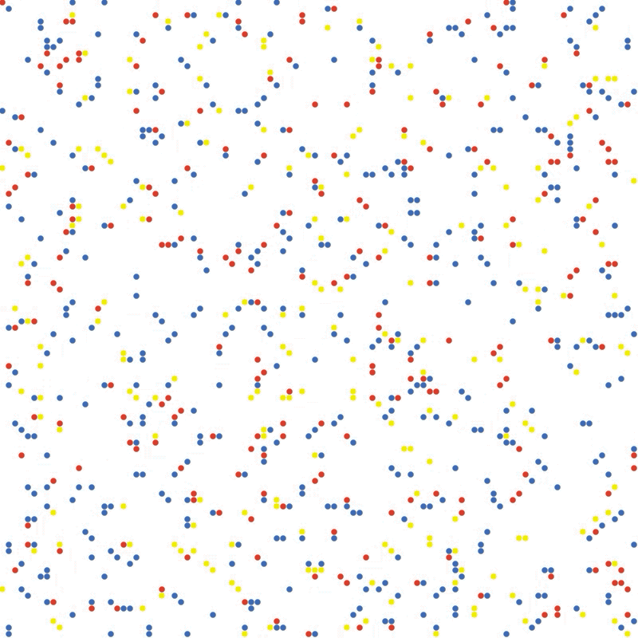

# TrustSim

Baseline                   |  Ecosystem                |  Tit-for-tat
:-------------------------:|:-------------------------:|:-------------------------:
      |     | 

This repo extends the model presented by Smaldino (2013) to answer whether, and under what circumstances, an element of reciprocity, or earned trust, is beneficial to cooperative agents. This report extends the Spatial Prisoner’s Dilemma game to include adaptive agents which choose to co-operate more frequently if their past interactions indicate that partners will reciprocate. Following Dasgupta’s definition of trust, we consider trust to represent an agent’s assumption about its partners choice of action, which will subsequently affect its own action. We consider reciprocity as a means to either reward or punish agents (a ”tit-for-tat” strategy), indirectly affecting cooperation (Phelps, 2013). We test the hypothesis that an increase in the initial proportion of adaptive agents significantly decreases the long-term proportion of rational agents. We also explore the effect of using both long and short term memory.

